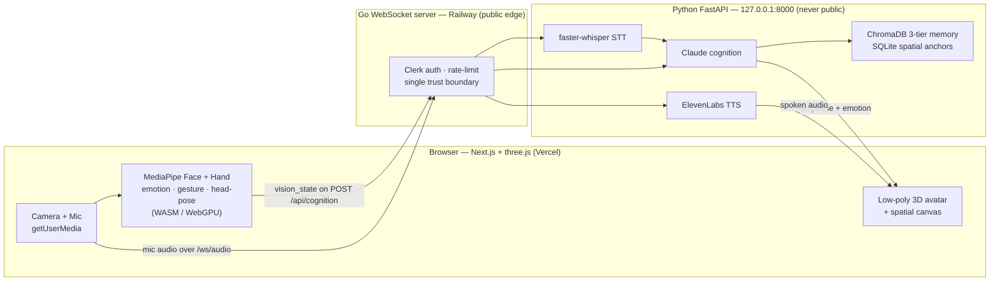

<div align="center">

# ARIA

### Adaptive Realtime Intelligence Avatar

**A real-time AI companion that sees you, listens, thinks with Claude, remembers you, and talks back as a live 3D avatar.**

[](https://go.dev)
[](https://python.org)
[](https://nextjs.org)
[](https://typescriptlang.org)
[](https://www.anthropic.com)
[](LICENSE)
[](https://codespaces.new/sucheet2000/aria?quickstart=1)

[**Live site**](https://sucheet2000.github.io/aria) · [Architecture](docs/architecture.md) · [Deploy runbook](docs/DEPLOY.md) · [Cloud dev (Codespaces)](.devcontainer/README.md) · [Contributing](CONTRIBUTING.md)

</div>

---

## What is ARIA?

ARIA is a multimodal voice companion. Your browser watches your face and hands with
MediaPipe, your microphone is transcribed to text, Claude reasons about what you said
and how you look, a three-tier memory keeps track of who you are across sessions, and a
low-poly 3D avatar answers you out loud with an expression that matches the moment.

It runs as three cooperating layers: a **Next.js browser app** that does all camera and
microphone work locally, a **Go WebSocket server** that is the single authenticated edge,
and a **Python service** that handles speech-to-text, Claude cognition, memory, and
text-to-speech.

### A note on privacy — the honest version

ARIA is **not** a fully on-device system, and we do not claim it is:

- **Camera frames never leave your browser.** Face and hand tracking (MediaPipe) runs
  entirely in the browser. Only the small derived signal — an emotion label, head-pose
  angles, and a few "face/hands detected" flags — is sent onward.
- **Your microphone audio is streamed to the server** so faster-whisper can transcribe it.
- **Your text reaches Claude** for the reasoning step, and the reply text is sent to
  ElevenLabs to be spoken.

So: video stays local; audio and text go to the server. That is the real posture.

---

## Features

- **Browser-side perception.** Camera + microphone capture and MediaPipe face/hand
  tracking, emotion, gesture, and head-pose estimation all run in the browser (WASM/WebGPU).
- **Voice in, voice out.** Mic audio streams to the server over a WebSocket, is transcribed
  by faster-whisper, and ARIA replies with ElevenLabs speech (with a browser-TTS fallback).
- **Wake-word gated.** Say **"Hey ARIA"** to wake it; say **"that would be all"** to send it
  back to sleep.
- **Claude cognition.** Each turn blends your message, your current expression, recent
  working memory, and long-term facts into a single prompt for Claude.
- **Three-tier memory.** ChromaDB stores profile, episodic, and working memory so ARIA
  remembers you between sessions.
- **Emotion-aware avatar.** A low-poly three.js avatar reflects ARIA's response emotion and
  your head pose in real time.
- **Spatial canvas.** Place and recall anchored objects in a shared 3D space, persisted in
  SQLite.
- **Cloud-ready.** Authenticated with Clerk, deployable to Railway (backend) + Vercel
  (frontend). See the [deploy runbook](docs/DEPLOY.md).

---

## Architecture

Camera and microphone capture, plus all vision inference, happen **in the browser**. The Go
server is the only public process — it verifies the Clerk token, rate-limits, and proxies to
a Python service that is never exposed to the internet.



Full write-up in [`docs/architecture.md`](docs/architecture.md); the design decisions behind
it are in [`docs/decisions.md`](docs/decisions.md).

---

## Quickstart

### Prerequisites

- **Go 1.26+**
- **Node.js 20+**
- **Python 3.13** (on Apple Silicon, use a native ARM64 build — e.g. miniconda-arm64)
- An **Anthropic API key** (Claude)
- An **ElevenLabs API key** (optional — falls back to browser text-to-speech)

### Install

```bash
git clone https://github.com/sucheet2000/aria.git
cd aria

# Python deps
pip install -r backend/requirements.txt

# Go deps
cd backend && go mod download && cd ..

# Frontend deps
cd frontend && npm install && cd ..

# Config
cp backend/.env.example backend/.env   # then add your ANTHROPIC_API_KEY
```

### Run (three terminals)

**Terminal 1 — Python cognition, STT, memory, and TTS service**

```bash
cd backend
export $(grep -v '^#' .env | xargs)
PYTHONPATH="$PWD" python3 -m uvicorn app.main:app --port 8000
```

> On Apple Silicon, point `python3` at your ARM64 interpreter (never system Python).

**Terminal 2 — Go WebSocket server** (spawns the audio-worker STT process)

```bash
cd backend
pkill -f "audio_worker.py" 2>/dev/null   # clear any stale worker
go run cmd/server/main.go
```

**Terminal 3 — Frontend**

```bash
cd frontend
npm run dev
```

Open **http://localhost:3000** and allow camera + microphone access. Say **"Hey ARIA"** to
start talking.

For cloud deployment (Railway + Vercel), follow [`docs/DEPLOY.md`](docs/DEPLOY.md).

---

## Project structure

```
aria/
├── SOUL.md                  ARIA's runtime identity (loaded into every Claude prompt)
├── proto/                   Protobuf contract + buf codegen  (see proto/README.md)
├── backend/
│   ├── cmd/server/          Go entrypoint
│   ├── internal/            Go: hub/WS, auth, cognition + TTS proxy, audio worker mgmt, config
│   ├── app/                 Python FastAPI
│   │   ├── api/             HTTP routes (cognition, tts)
│   │   ├── cognition/       Claude prompt building + memory
│   │   ├── pipeline/        audio worker, VAD, transcriber, wake-word, TTS voice engine
│   │   ├── spatial/         SQLite spatial-anchor registry
│   │   └── observability/   metrics
│   ├── gen/                 Generated proto stubs (Go + Python)
│   └── tests/               Python test suite
├── frontend/
│   └── src/
│       ├── app/             Next.js routes
│       ├── components/      avatar, chat, status panels
│       ├── hooks/           camera + mic capture, cognition, TTS, WebSocket
│       ├── lib/perception/  ported emotion / gesture / head-pose (TypeScript)
│       ├── spatial/         three.js spatial canvas + world model
│       └── store/           Zustand state
└── docs/                    architecture, decisions, deploy, standards, reference, archive
```

---

## Tech stack

| Layer | Technology |
|-------|-----------|
| Browser perception | `@mediapipe/tasks-vision` (Face + Hand landmarker), WASM/WebGPU |
| Frontend | Next.js 14, TypeScript, three.js (`@react-three/fiber` + `drei`), Tailwind, Zustand |
| Auth | Clerk |
| Edge server | Go 1.26, chi, gorilla/websocket, zerolog |
| Cognition | Claude (Anthropic) |
| Speech-to-text | faster-whisper, webrtcvad |
| Text-to-speech | ElevenLabs (browser Web Speech API fallback) |
| Memory | ChromaDB (profile / episodic / working) |
| Spatial anchors | SQLite |
| Contract | Protobuf via buf |
| Deploy | Railway (backend) + Vercel (frontend) |

---

## Roadmap

**Done** — real-time perception, voice loop, Claude cognition, three-tier memory,
emotion-aware avatar, spatial canvas, Clerk auth, and browser-side perception (camera/mic
moved fully client-side so ARIA runs in the cloud and per-user).

**In progress** — the professionalization + cloud program: public-repo readiness, dead-code
retirement, and the Railway + Vercel deployment. Tracked in
[`docs/plans/2026-07-10-aria-restructure-design.md`](docs/plans/2026-07-10-aria-restructure-design.md).

<details>
<summary>Where the older weekly roadmap went</summary>

The v1–v3 weekly build history (gRPC transport, NATS, CoreML/ANE acceleration, and the
server-side perception era) has been superseded by the browser-perception architecture and
moved to [`docs/archive/`](docs/archive/). It is kept for history, not as current guidance.

</details>

---

## Contributing

Contributions are welcome. Branch off `integration`, use
[Conventional Commits](https://www.conventionalcommits.org/), and make the gates pass before
opening a PR:

- **Python** — `ruff check .`, `mypy app tests`, `pytest`
- **Go** — `go build ./...`, `go vet ./...`, `go test ./...`
- **Frontend** — `npm run lint`, `npm run type-check`, `npm run build`, `npm test`

See [`CONTRIBUTING.md`](CONTRIBUTING.md) for the full workflow and
[`AGENTS.md`](AGENTS.md) for the cross-tool coding rules.

---

## License

Released under the [MIT License](LICENSE).
</content>
</invoke>
