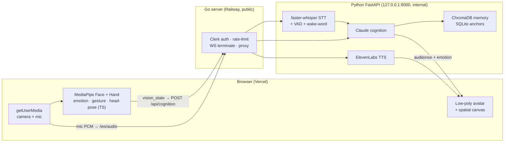

# ARIA System Architecture

## Overview

ARIA is a three-layer real-time system:

- **Browser (Next.js + three.js)** captures the camera and microphone, runs all vision
  inference locally with MediaPipe, and renders the 3D avatar.
- **Go WebSocket server** is the single public edge. It verifies the Clerk auth token,
  rate-limits, terminates the WebSockets, and proxies to Python. It never does ML.
- **Python (FastAPI)** does speech-to-text, Claude cognition, memory, and text-to-speech.
  It is internal-only and never exposed to the internet.

The key design point is that **perception moved into the browser**. There is no longer a
server-side camera or microphone. A cloud container has no physical devices, so capture and
face/hand tracking run per-user in each browser tab; only the derived signals and the mic
audio are sent to the server.

## System diagram



## Data flow

### Vision (in the browser)

```
Webcam frame (getUserMedia)
  -> MediaPipe FaceLandmarker + HandLandmarker  (WASM / WebGPU, in-browser)
  -> emotion + head-pose + gesture              (ported to TypeScript)
  -> a compact vision_state object
  -> attached to the POST /api/cognition request body
```

Only the derived `vision_state` leaves the browser — never the raw camera frames.

### Voice (browser capture, server STT)

```
Microphone (getUserMedia, browser)
  -> streamed as PCM over the /ws/audio WebSocket
  -> Go forwards the audio to the Python audio worker
  -> webrtcvad marks utterance boundaries
  -> faster-whisper transcribes
  -> wake-word / sleep-phrase gate decides whether to forward
  -> transcript returned to the browser, which sends it to /api/cognition
  -> Claude responds; the browser requests TTS
  -> ElevenLabs streams audio back; the browser plays it and animates the avatar
```

### Cognition turn

```
Each turn combines:
  - the user's message (typed, or transcribed speech)
  - current vision_state (emotion, head pose, face/hands detected)
  - working memory (recent symbolic inferences for this session)
  - episodic + profile memory retrieved from ChromaDB
        |
        v
  FastAPI builds the Claude prompt (identity from SOUL.md as the stable prefix)
        |
        v
  Claude returns { symbolic_inference, world_model_update, natural_language_response }
        |
        v
  High-confidence facts are written back to ChromaDB; spatial anchors persist to SQLite
```

**Emotional conflict handling:** when speech sentiment and visible expression disagree, ARIA
responds to the observed state through open invitation rather than validating or challenging
the words (see `SOUL.md`).

## Module responsibilities

### Go server (`backend/cmd/`, `backend/internal/`)
- The only public process; binds `0.0.0.0:$PORT` in the cloud, `:8080` locally.
- Verifies the Clerk token on every request and per WebSocket connection.
- Per-user and global rate limiting on the paid endpoints.
- Terminates `/ws` (session channel) and `/ws/audio` (browser mic stream).
- Spawns and supervises the Python audio worker; forwards mic PCM to it.
- Proxies `POST /api/cognition` and `POST /api/tts` to the Python service, adding the
  internal-auth header and the resolved owner identity.

### Python FastAPI (`backend/app/`)
- `api/` — HTTP routes for cognition and TTS.
- `cognition/` — builds the Claude prompt from `SOUL.md`, vision state, and memory; calls
  Claude; parses the structured response.
- `pipeline/` — the audio worker (VAD, faster-whisper, wake-word/sleep-phrase state
  machine) and the TTS voice engine.
- `spatial/` — SQLite anchor registry (create / get / list / update / delete).
- `observability/` — metrics collection.

### Next.js frontend (`frontend/src/`)
- `hooks/useVisionCapture` — camera capture + MediaPipe inference in the browser.
- `hooks/useAudioCapture` — mic capture streamed to `/ws/audio`.
- `hooks/useWebSocket`, `useCognition`, `useTTS` — session channel, cognition calls, playback.
- `lib/perception/` — TypeScript ports of emotion, gesture, and head-pose math.
- `components/` — the low-poly avatar, chat, and status panels.
- `spatial/` — the three.js spatial canvas and the shared world model.
- `store/` — Zustand state for perception, conversation, and session.

## Trust boundary and deployment

- **Python is never public.** Only the Go port is exposed. FastAPI stays on
  `127.0.0.1:8000` inside the container. Go is the single auth boundary; Python trusts the
  owner identity Go sets after verifying the Clerk token.
- **Defense in depth:** Go and Python share an `INTERNAL_AUTH_SECRET` so an accidentally
  exposed `:8000` still cannot forge requests.
- Backend deploys to **Railway** (one Docker image running the Go server + the Python
  service); frontend deploys to **Vercel**. Full runbook in [`DEPLOY.md`](DEPLOY.md).

## Environment configuration

All configuration is via environment variables. `backend/.env.example` lists the local-dev
set; the production set (Clerk, rate limits, `DATA_DIR`, `INTERNAL_AUTH_SECRET`, CORS) is
documented in [`DEPLOY.md`](DEPLOY.md).

## History

The earlier server-side perception design (Python vision/audio workers opening the server's
own camera and mic, a gRPC `PerceptionService`, and a NATS frame bus) has been retired. Those
design docs live in [`archive/`](archive/) for historical reference. The move to
browser-side perception is described in
[`plans/2026-07-11-a2-browser-perception-design.md`](plans/2026-07-11-a2-browser-perception-design.md).
</content>
